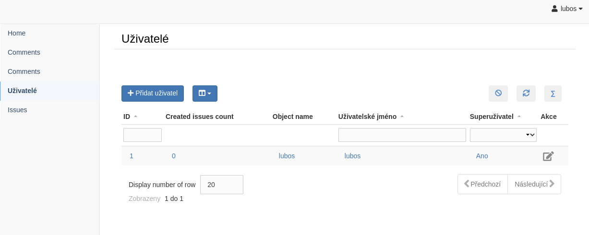
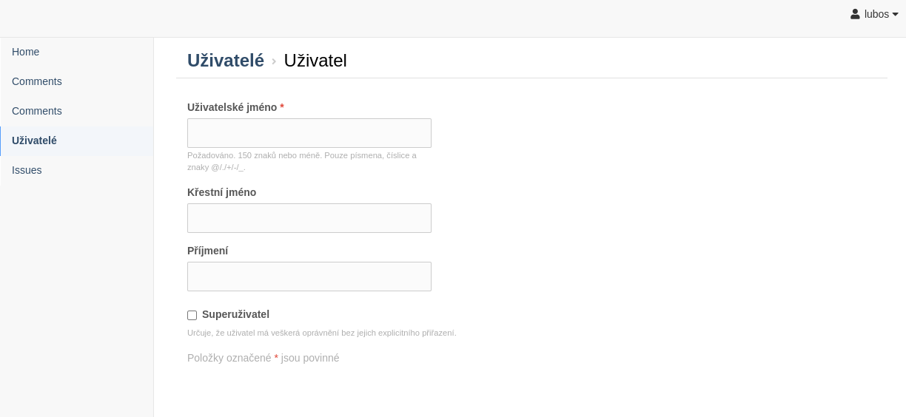
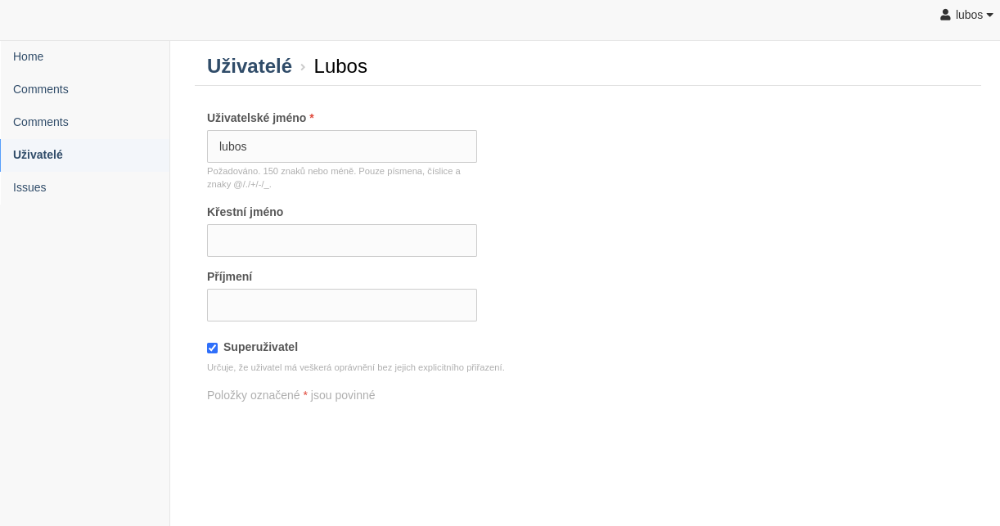

Cores
=====

DjangoUiRestCore
----------------

The purpose of ``Core`` is to get a shared functionality of views into a one source.
The ``DjangoUiRestCore`` class is the representation of a model in the **django-is-core** interface. These
representations are stored in a file named ``cores.py`` in your application. We will start with the most common case when
you want to create three typical views for information system:

  * table view for printing objects
  * add view for creating new objects
  * detail view for reading or editing objects

As example project we use Issue tracker. Firstly for every application you need management of users. We use default
**Django** user model.

For creating **add**, **detail** and **table** views you must only create file ``cores.py`` inside specific application that
contains::

    from django.contrib.auth.models import User

    from is_core.main import DjangoUiRestCore

    class UserCore(DjangoUiRestCore):
        model = User

There is no obligation for registration. Cores are registered automatically. The result views with preview are:

Table/List
^^^^^^^^^^

Add
^^^

Edit
^^^^

REST
^^^^
But there is created REST resource too. By default on URLs ``/api/user/`` and ``/api/user/{obj_id}`` that returns
object in asked format (HTTP header ``Content-type: application/json``).

DjangoRestCore
--------------

The ``DjangoRestCore`` is parent of ``DjangoUiRestCore``. As the name suggests this class is used only for creating
REST resources without UI HTML views. The usage is the same as ``DjangoUiRestCore``::

    from django.contrib.auth.models import User

    from is_core.main import DjangoRestCore

    class UserRestCore(DjangoRestCore):
        model = User

DjangoUiCore
------------

The ``DjangoUiCore`` is the second parent of ``DjangoUiRestCore``. It is used for creating only UI views. Because UI
views needs some REST resources is necessary to specify on which URL is deployed REST resource of model (api_url_name is
transformed to URL by Django resolve helper)::

    from django.contrib.auth.models import User

    from is_core.main import DjangoUiCore

    class UiUserCore(DjangoUiCore):
        model = User
        api_url_name = 'api-user'

You can specify URL manually::

    class UiUserCore(DjangoUiCore):
        model = User

        def get_api_url(self, request):
            return '/api/user/'

Core hierarchy
--------------

Now we provide detailed description of all Core objects. Firstly for better understanding you can see UML class
diagram of core hierarchy.

.. image:: .images/cores.png

Core
----

Following options and methods can be applied for all Core objects like ``DjangoRestCore``, ``DjangoUiCore`` or
``DjangoUiRestCore`` (all descendants of Core class).

Options
^^^^^^^

.. attribute:: Core.abstract

The variable ``abstract`` provides way how to create core that is not registered but this class variable is not inherited.
Let's show an example::

    from django.contrib.auth.models import User

    from is_core.main import DjangoRestCore

    class AbstractUiRestUserCore(DjangoRestCore):
        model = User
        abstract = True
        verbose_name = 'example of abstract user core'

    class UiRestUserCore(AbstractUiRestUserCore):
        pass

First core is not registered. Therefore views and REST resources are not created. But the second core that inherits from
the abstract core is registered. All configuration from parent class is inhered (without abstract variable).

.. attribute:: Core.verbose_name,Core.verbose_name_plural

These variables are used inside generic views. It can be added to ``context_data`` and rendered inside templates.

.. attribute:: Core.menu_group

It is necessary have a slug that distinguish one core from another. For this purpose is used variable ``menu_group``.
This variable is used for example to generate URL patterns or menu. Value of the variable is generated automatically
for cores that is connected to model.

Methods
^^^^^^^

.. method:: Core.init_request(request)

Every core views/REST resources calls this method before calling dispatch. You can use it to change request its calling.

.. method:: Core.get_url_prefix()

Every core must have unique URL. Therefore a method ``get_url_prefix`` is way how to achieve it. Method defines URL
prefix for all views and rest resources. By default the URL prefix is value of attribute menu_group.

DjangoCore
-----------

The next class that extends ``Core`` is ``DjangoCore``. All cores that inherits from DjangoCore works
as controller over a model.

Options
^^^^^^^

.. attribute:: DjangoCore.list_actions

Variable ``list_action`` contains actions that user can perform via REST or UI. More detailed explanation with example
you find inside ``DjangoUiRestCore options`` part.

.. attribute:: DjangoCore.fields

Use the ``fields`` option to make simple layout changes in the **add** and **detail** views and REST resources
pages such as showing only a subset of available fields, modifying their order, or grouping them into rows. We will
show it on ``DjangoUiRestCore``. If you want to set fields to ``username``, ``first_name`` and ``last_name``
the simplest way is to use::

    from django.contrib.auth.models import User

    from is_core.main import DjangoUiRestCore

    class UserCore(DjangoUiRestCore):
        model = User
        fields = ('username', 'fist_name', 'last_name')

.. attribute:: DjangoCore.form_class

If you want to change default form class which is ``SmartModelForm`` you can change it with this option. The form is
changed for **add**, **detail** views and REST resources too.

.. attribute:: DjangoCore.ordering

Option for changing default ordering of model for core.::

    from django.contrib.auth.models import User

    from is_core.main import DjangoUiRestCore

    class UserCore(DjangoUiRestCore):
        model = User
        ordering = ('last_name', 'fist_name', '-created_at')

Methods
^^^^^^^

.. method:: DjangoCore.get_fields(request, obj=None)

Use this method to define form fields dynamically or if you want to define different form fields for **add**, **detail**,
view of REST resources.

.. method:: DjangoCore.get_form_exclude(request, obj=None)

The opposite to get_fields.

.. method:: DjangoCore.get_form_class(request, obj=None)

Use this method to define form dynamically or if you want to define different form for **add**, **detail** view of REST
resources.

.. method:: DjangoCore.pre_save_model(request, obj, form, change)

Method ``per_save_model`` is called before saving object to database. Body is empty by default.

.. method:: DjangoCore.post_save_model(request, obj, form, change)

Method ``post_save_model`` is called after saving object to database. Body is empty by default.

.. method:: DjangoCore.save_model(request, obj, form, change)

You can rewrite this method if you want to change way how is object saved to database. Default body is::

    def save_model(self, request, obj, form, change):
        obj.save()

.. method:: DjangoCore.pre_delete_model(request, obj)

Method ``pre_delete_model`` is called before removing object from database. Body is empty by default.

.. method:: DjangoCore.post_delete_model(request, obj)

Method ``post_delete_model`` is called after removing object from database. Body is empty by default.

.. method:: DjangoCore.delete_model(request, obj)

You can rewrite this method if you want to change way how is object removed from database. Default body is::

    def delete_model(self, request, obj):
        obj.delete()

.. method:: DjangoCore.verbose_name(),DjangoCore.verbose_name_plural()

Default verbose names of ``DjangoCore`` is get from model meta options::

    self.model._meta.verbose_name
    self.model._meta.verbose_name_plural

.. method:: DjangoCore.menu_group()

Default ``menu_group`` value is get from module name of model (``self.model._meta.module_name``)

.. method:: DjangoCore.get_ordering(request)

Use this method if you want to change ordering dynamically.

.. method:: DjangoCore.get_queryset(request)

Returns model queryset, ordered by defined ordering inside core. You can filter here objects according to user
permissions.

.. method:: DjangoCore.preload_queryset(request, qs)

The related objects of queryset should sometimes very slow down retrieving data from the database. If you want to
improve a speed of your application use this function to create preloading of related objects.

.. method:: DjangoCore.get_list_actions(request, obj)

Use this method if you want to change ``list_actions`` dynamically.

.. method:: DjangoCore.get_default_action(request, obj)

Chose default action for object used inside UI and REST. For example default action is action that is performed if you
select row inside table of objects. For table view default action is open **detail** view. If you return ``None``
no action is performed by default.

UICore
--------

Options
^^^^^^^

.. attribute:: UiCore.menu_url_name

Every UI core has one place inside menu that addresses one of UI views of a core. This view is selected by option
``menu_url_name``.

.. attribute:: UiCore.show_in_menu

Option `show_in_menu` is set to ``True`` by default. If you want to remove core view from menu set this option to
``False``.

.. attribute:: UiCore.view_classes

Option contains view classes that are automatically added to Django urls. Use this option to add new views. Example
you can see in section generic views (this is a declarative way if you want to register views dynamically see
``UiCore.get_view_classes``).::

    from django.contrib.auth.models import User

    from is_core.main import DjangoUiRestCore

    from .views import MonthReportView

    class UserCore(DjangoUiRestCore):
        model = User

        view_classes = (
            ('reports', r'^/reports/$', MonthReportView),
        )

.. attribute:: UiCore.default_ui_pattern_class

Every view must have assigned is-core pattern class. This pattern is not the same patter that is used with **django**
`urls`. This pattern has higher usability. You can use it to generate the url string or checking permissions. Option
default_ui_pattern_class contains pattern class that is used with defined view classes. More about patterns you can
find in section patterns. #TODO add link

Methods
^^^^^^^

.. method:: UiCore.init_ui_request(request)

Every view defined with option ``view_classes`` calls this method before calling dispatch. The default implementation of
this method calls parent method ``init_request``::

    def init_ui_request(self, request):
        self.init_request(request)

.. method:: UiCore.get_view_classes()

Use this method if you want to change ``view_classes`` dynamically. A following example shows overriding **detail** view
and registering a custom view::

    from django.contrib.auth.models import User

    from is_core.main import DjangoUiRestCore

    from .views import UserDetailView, MonthReportView

    class UserCore(DjangoUiRestCore):
        model = User

        def get_view_classes(self):
            view_classes = super(UserCore, self).get_view_classes()
            view_classes['detail'] = (r'^/(?P<pk>\d+)/$', UserDetailView)
            view_classes['reports'] = (r'^/reports/$', MonthReportView)
            return view_classes

.. method:: UiCore.get_ui_patterns()

Contains code that generates ``ui_patterns`` from view classes. Method returns ordered dict of pattern classes.

.. method:: UiCore.get_show_in_menu(request)

Returns ``boolean`` if menu link is provided for the core, by default there are three rules:

 * show_in_menu must be set to ``True``
 * menu_url_name need not be empty
 * current user must have permissions to see the linked view

.. method:: UiCore.is_active_menu_item(request, active_group)

This method finds if a menu link of a core is active (if the view with ``menu_url_name`` is the current displayed page).

.. method:: UiCore.get_menu_item(request, active_group)

This method returns a menu item object that contains information about the link displayed inside menu.

.. method:: UiCore.menu_url(request, active_group)

Returns URL string of menu item.

RESTCore
----------

``RESTCore`` is very similar to ``UiCore``, but provides REST resources instead of UI views.

Options
^^^^^^^

.. attribute:: RestCore.rest_classes

Option contains REST classes that are automatically added to django urls. Use this option to add new REST resources.
Example you can see in section REST. #TODO add link

.. attribute:: RestCore.default_rest_pattern_class

As UI views every resource must have assigned is-core pattern class. Default pattern for REST resources is
`RestPattern`. More about patterns you can find in section patterns. #TODO add link

Methods
^^^^^^^

.. method:: RestCore.init_rest_request(request)

Every resource defined with option ``rest_classes`` calls this method before calling dispatch. The default implementation
of this method calls parent method ``init_request``.

.. method:: RestCore.get_rest_classes()

Use this method if you want to change ``rest_classes`` dynamically.

.. method:: RestCore.get_rest_patterns()

Contains code that generates ``rest_patterns`` from rest classes. Method returns an ordered dict of pattern classes.

HomeUiCore
------------

``HomeCore`` contains only one UI view which is index page. By default this page is empty and contains only menu
because every information system has custom index. You can very simply change default view class by changing ``settings``
attribute ``HOME_VIEW``, the default value is::

    HOME_VIEW = 'is_core.generic_views.HomeView'

You can change whole is core too by attribute ``HOME_IS_CORE``, default value::

    HOME_IS_CORE = 'is_core.main.HomeUiCore'

DjangoUiCore
-------------

``DjangoUiCore`` represents core that provides standard views for model creation, editation and listing. The
``DjangoUiCore`` will not work correctly without REST resource. Therefore you must set ``api_url_name`` option.

Options
^^^^^^^

.. attribute:: DjangoUiCore.default_model_view_classes

For the ``DjangoUiCore`` default views are **add**, **detail** and **list**::

    default_model_view_classes = (
        ('add', r'^/add/$', DjangoModelAddFormView),
        ('detail', r'^/(?P<pk>[-\w]+)/$', DetailModelFormView),
        ('list', r'^/?$', TableView),
    )

.. attribute:: DjangoUiCore.api_url_name

The ``api_url_name`` is required attribute. The value is pattern name of REST resource.

.. attribute:: DjangoUiCore.list_fields

Set ``list_fields`` to control which fields are displayed on the list page.

.. attribute:: DjangoUiCore.export_display

Set ``export_fields`` to control which fields are displayed inside exports (e.g. PDF, CSV, XLSX).

.. attribute:: DjangoUiCore.export_types

REST resources provide the ability to export output to several formats:

 * XML
 * JSON
 * CSV
 * XLSX (you must install library XlsxWriter)
 * PDF (you must install library reportlab)

List view provides export buttons. Option ``export_types`` contains tripple:
 * title
 * type
 * serialization format (content-type).

 For example if you want to serialize users to CSV::

    class UiRestUserCore(UIRestCore):
        export_types = (
            ('export to csv', 'csv', 'text/csv'),
        )

If you want to set ``export_types`` for all cores you can use ``EXPORT_TYPES`` attribute in your settings::

    EXPORT_TYPES = (
        ('export to csv', 'csv', 'text/csv'),
    )

.. attribute:: DjangoUiCore.field_labels

Framework by default generates labels for field names from django model fields verbose name, short description of model, view or resource method, but you can change this behaviour with field names::

    class UiRestUserCore(UIRestCore):

        fields = ('first_name', 'last_name', 'watching_issues__name', 'leading_issue__name', 'solving_issue__name', 'watching_issues', 'leading_issue')

        field_labels = {
            'first_name': 'first name changed label',
            'watching_issues': 'watching issues changed label',
            'leading_issue__': 'leading issues changed label',
            'solving_issue__name': 'solving issue name label',
        }

The result of form field labels will be:
* 'first_name' => 'first name changed label'
* 'last_name' => '{generated value}'
* 'watching_issues__name' => 'watching issues changed label - {generated value}'
* 'leading_issue__name' => 'leading issues changed label - {generated value}'
* 'solving_issue__name' => 'solving issue name label'
* 'watching_issues' => 'watching issues changed label'
* 'leading_issue' => '{generated value}'  # because overriden was value leading_issue__

If you want to remove some label generated from relation prefix, you can use ``None`` as field label value::

    class UiRestUserCore(UIRestCore):

        fields = (''watching_issues__name',)

        field_labels = {
            'watching_issues__': None,
        }

The result will be only generated value from ``name`` field.

.. attribute:: DjangoUiCore.default_list_filter

UI table view support filtering data from REST resource. There are situations where you need to set default values for
filters. For example if you want to filter only superusers you can use::

    class UiRestUserCore(UIRestCore):
        default_list_filter = {
            'filter': {
                'is_superuser': True
            }
        }

On the other hand if you want to filter all users that is not superusers::

    class UiRestUserCore(UIRestCore):
        default_list_filter = {
            'exclude': {
                'is_superuser': True
            }
        }

Exclude and filter can be freely combined::

    class UiRestUserCore(UIRestCore):
        default_list_filter = {
            'filter': {
                'is_superuser': True
            },
            'exclude': {
                'email__isnull': True
            }
        }

.. attribute:: DjangoUiCore.form_inline_views

The **django-is-core** interface has the ability to edit models on the same page as a parent model. These are called
inlines. We will use as example new model issue of issue tracker system::

    class Issue(models.Model):
        name = models.CharField(max_length=100)
        watched_by = models.ManyToManyField(AUTH_USER_MODEL)
        created_by = models.ForeignKey(AUTH_USER_MODEL)

Now we want to add inline form view of all reported issues to user **add** and **detail** views::

    class ReportedIssuesInlineView(TabularInlineFormView):
        model = Issue
        fk_name = 'created_by'

    class UiRestUserCore(UIRestCore):
        form_inline_views = (ReportedIssuesInlineView,)

The ``fk_name`` is not required if there is only one relation between ``User`` and ``Issue``. More about inline views you
can find in generic views section # TODO add link.

.. attribute:: DjangoUiCore.fieldsets

Set ``fieldsets`` to control the layout of core **add** and **change** pages. Fieldset defines a list of form fields
too. If you set ``fieldsets`` the ``fields`` is rewritten with a set of all fields from fieldsets.
Therefore you should use only one of these attributes.

``fieldsets`` is a list of two-tuples, in which each two-tuple represents a <fieldset> on the core form page.
(a <fieldset> is a **section** of the form.).

The two-tuples are in the format (``name``, ``field_options``), where name is a string representing the title of the
``fieldset`` and ``field_options`` is a dictionary of information about the ``fieldset``, including a list of fields
to be displayed in it.

As a example we will use ``User`` model again::

    class UiRestUserCore(UIRestCore):
        fieldsets = (
            (None, {'fields': ('username', 'email')}),
            ('profile', {'fields': ('first_name', 'last_name'), 'classes': ('profile',)}),
        )

If neither ``fieldsets`` nor ``fields`` options are present, **Django** will default to displaying each field
that isn’t an ``AutoField`` and has ``editable=True``, in a single ``fieldset``, in the same order as the fields are
defined in the model.

The ``field_options`` dictionary can have the following keys:

 * fields

  A tuple of field names to display in this ``fieldset``. This key is required.

  Example::

    {
        'fields': ('first_name', 'last_name'),
    }

  fields can contain values defined in ``form_readonly_fields`` to be displayed as read-only.

  If you add ``callable`` to fields its result will be displayed as read-only.

 * classes

  A list or a tuple containing extra CSS classes to apply to the fieldset.

  Example::

    {
        'classes': ('profile',),
    }

 * inline_view

  ``inline_view`` attribute can not be defined together with ``fields``. This attribute is used for definig position of
  inline view inside form view. The value of the attribute is a string class name of the inline view.

  Example::

     {
         'inline_view': 'ReportedIssuesInlineView'
     }

.. attribute:: DjangoUiCore.form_readonly_fields

By default the **django-is-core** shows all fields as editable. Any fields in this option (which should be a list or
a tuple) will display its data as-is and non-editable. Compare to **django-admin** fields defined in a form are used
too (due ``SmartModelForm``).

.. attribute:: DjangoUiCore.menu_url_name

``menu_url_name`` is set to ``list`` by default, for all ``DjangoUiCore`` and its descendants.

Methods
^^^^^^^

.. method:: UiCore.get_fieldsets(request, obj=None)

Use this method if you want to change ``fieldsets`` dynamically.

.. method:: UiCore.get_readonly_fields(request, obj=None)

Use this method if you want to change ``readonly_fields`` dynamically.

.. method:: UiCore.get_form_inline_views(request, obj=None)

Use this method if you want to change ``form_inline_views`` dynamically.

.. method:: UiCore.get_default_list_filter(request)

Use this method if you want to change ``default_list_filter`` dynamically.

.. method:: UiCore.get_list_display(request)

Use this method if you want to change ``list_display`` dynamically.

.. method:: UiCore.get_export_display(request)

Method returns ``export_display`` if no export_display is set the output is result of method
``get_list_display(request)``.

.. method:: UiCore.get_export_types(request)

Use this method if you want to change ``export_types`` dynamically.

.. method:: UiCore.get_api_url_name(request)

Use this method if you want to change ``api_url_name`` dynamically.

.. method:: UiCore.get_api_url(request)

A result of this method is an URL string of REST API. The URL is generated with **Django** reverse function from
``api_url_name`` option.

.. method:: UiCore.get_add_url(request)

Returns an URL string of **add** view. Rewrite this method if you want to change a link of add button at the list view.

DjangoRestCore
---------------

``DjangoRestCore`` represents core that provides a standard resource with default CRUD operations.

Options
^^^^^^^

.. attribute:: DjangoRestCore.rest_detailed_fields

Set ``rest_detailed_fields`` if you want to define fields that will be returned inside REST response for a request on
concrete object (an URL contains an ID of a concrete model object. For example an URL of a request is ``/api/user/1/``).
This option rewrites settings inside ``RESTMeta`` (you can find more about it at section #TODO add link).

.. attribute:: DjangoRestCore.rest_general_fields

Set ``rest_general_fields`` if you want to define fields that will be returned inside REST response for a request on
more than one object (an URL does not contain an ID of a concrete objects, eq. ``/api/user/``). This defined set of
fields is used for generating result of a foreign key object. This option rewrites settings inside ``RESTMeta``
(you can find more about it at section #TODO add link).

.. attribute:: DjangoRestCore.rest_extra_fields

Use ``rest_extra_fields`` to define extra fields that is not returned by default, but can be extra requested
by a HTTP header ``X-Fields`` or a GET parameter ``_fields``. More info you can find in **django-piston** library
documentation. This option rewrites settings inside ``RESTMeta`` (you can find more about it at section #TODO add link).

.. attribute:: DjangoRestCore.rest_default_guest_fields

``rest_guest_fields`` contains list of fields that can be seen by user that has not permission to see the whole
object data. In case that a user has permission to see an object that is related with other object that can not be
seen. In this situation is returned only fields defined inside ``rest_guest_fields``. This option rewrites settings
inside ``RESTMeta`` (you can find more about it at section #TODO add link).

.. attribute:: DjangoRestCore.rest_default_detailed_fields

The purpose of ``rest_default_detailed_fields`` is the same as ``rest_detailed_fields`` but this option does not rewrite
settings inside ``RESTMeta`` but the result fields is intersection of ``RESTMeta`` options and this option.

.. attribute:: DjangoRestCore.rest_default_general_fields

The purpose of ``rest_default_general_fields`` is the same as ``rest_general_fields`` but this option does not rewrite
settings inside ``RESTMeta`` but the result fields is intersection of ``RESTMeta`` options and this option.

.. attribute:: DjangoRestCore.rest_default_extra_fields

The purpose of ``rest_default_extra_fields`` is the same as ``rest_extra_fields`` but this option does not rewrite
settings inside ``RESTMeta`` but the result fields is intersection of ``RESTMeta`` options and this option.

.. attribute:: DjangoRestCore.rest_default_guest_fields

The purpose of ``rest_default_guest_fields`` is the same as ``rest_guest_fields`` but this option does not rewrite
settings inside ``RESTMeta`` but the result fields is intersection of ``RESTMeta`` options and this option.

.. attribute:: DjangoRestCore.rest_allowed_methods

A default value of ``rest_allowed_methods`` is::

    rest_allowed_methods = ('get', 'delete', 'post', 'put')

Use this option to remove a REST operation from a model REST resource. For example if you remove ``post``, the REST
resource will not be able to create new model object::

    rest_allowed_methods = ('get', 'delete', 'put')

.. attribute:: DjangoRestCore.rest_obj_class_names

This option is used with ``UiCore``. A REST resource will return a list of defined class names inside a response.
The atribute inside response has named ``_class_names``.

.. attribute:: DjangoRestCore.rest_resource_class

A default resource class is ``RESTModelResource``. You can change it with this attribute.
